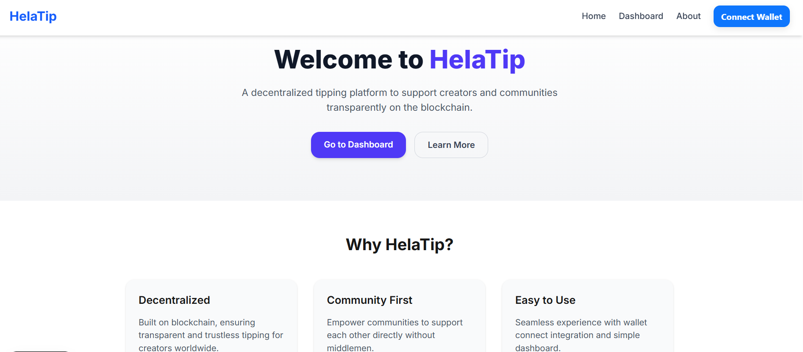

# HelaTip 💸

A fully functional decentralized tipping platform to support creators, built for the **Hela x Farcaster "Hack the Cast"** event. This project is built with a modern Web3 stack including **Next.js 14, TailwindCSS, Wagmi, and RainbowKit**.

## 📸 Screenshot


---

## 🚀 Features

-   ✅ **Modern Landing Page:** A clean and professional homepage.
-   ✅ **Web3 Wallet Integration:** Seamless wallet connection using Wagmi & RainbowKit, configured specifically for the **HeLa Testnet**.
-   ✅ **Functional Tipping Dashboard:** An interface for users to connect their wallet and send `HLUSD` tips on-chain.
-   🚧 **(Next Up) Farcaster Frame Integration:** The core hackathon feature to enable tipping directly from the Farcaster social feed.

## 🛠️ Tech Stack

-   [Next.js 14](https://nextjs.org/)
-   [TailwindCSS](https://tailwindcss.com/)
-   [Wagmi](https://wagmi.sh/) & [RainbowKit](https://www.rainbowkit.com/) for Wallet & Blockchain Interaction
-   (Planned) [frames.js](https://framesjs.org/) for Farcaster Frame development

---

## ⚙️ Getting Started

### 1. Environment Variables

First, you need to create a `.env.local` file in the root of the project and add your WalletConnect Project ID. You can get one from [WalletConnect Cloud](https://cloud.walletconnect.com/).


### 2. Run the Development Server

Then, install the dependencies and run the server:

```bash
npm install
npm run dev

